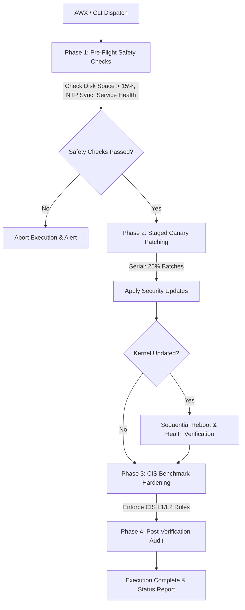

# 🛡️ Enterprise Linux Fleet Patching & CIS Compliance Framework

[](https://github.com/vaibhavmahna/ansible-enterprise-patch-compliance/actions/workflows/ci.yml)
[](https://ansible.com)
[](https://github.com/ansible/awx)
[](https://redhat.com)
[](https://ubuntu.com)
[](#)
[](LICENSE)

An environment-agnostic, production-grade Ansible automation framework and **Red Hat AWX / Ansible Tower** workflow for automated Linux OS patching, zero-downtime canary rollouts, and **CIS Level 1 & Level 2** security benchmark compliance.

---

## 🎯 Architectural Overview



---

## ✨ Features & Guardrails

- 🌐 **Environment-Agnostic**: Supports RHEL 8/9, Rocky Linux, Ubuntu 20.04/22.04, and Debian without environment lock-in.
- 🧪 **Safe Dry-Run Support**: Full compatibility with Ansible `--check` mode for zero-risk dry runs and compliance audits.
- 🛡️ **Pre-Flight Guardrails**: Verifies free disk space (`>15%`), NTP clock synchronization, and critical daemon states (`sshd`, `auditd`) prior to applying updates.
- ⚡ **Zero-Downtime Rolling Updates**: Configured for batch execution (`serial: 25%`) with automated post-reboot health verification.
- 🔒 **CIS Level 1 & 2 Hardening**: Modular Ansible role enforcing PAM security policies, SSH cipher hardening, sysctl kernel parameters, and audit logging rules.
- 📊 **AWX / Ansible Tower Ready**: Includes an exportable JSON workflow definition featuring RBAC delegation and webhook notifications.

---

## 📁 Repository Structure

```
ansible-enterprise-patch-compliance/
├── README.md                           # Documentation & Architecture
├── site.yml                            # Master Orchestration Playbook
├── ansible.cfg                         # Ansible Configuration Settings
├── inventory/
│   ├── hosts.example.yml               # Sample Inventory Structure
│   └── group_vars/
│       ├── all.yml                     # Global Thresholds & Variables
│       ├── redhat.yml                  # RedHat / DNF Configuration
│       └── debian.yml                  # Ubuntu / APT Configuration
├── roles/
│   ├── pre_flight_checks/              # Phase 1: Pre-Flight Safety Validation
│   ├── patch_management/              # Phase 2: Patch Execution & Managed Reboot
│   └── cis_hardening/                  # Phase 3: CIS Level 1 & 2 Hardening
└── awx/
    └── awx_workflow_template.json      # Declarative AWX Tower Workflow Export
```

---

## 🚀 Quickstart Guide

### 1. Prerequisites
- Ansible Core `2.12+` installed on control node.
- SSH key access to target Linux hosts with `sudo` privileges.

### 2. Setup Inventory
Copy the example inventory and edit your target hosts:

```bash
cp inventory/hosts.example.yml inventory/hosts.yml
```

### 3. Dry-Run Audit (Zero Risk)
Run in check mode to perform a compliance & health audit without making any system changes:

```bash
ansible-playbook -i inventory/hosts.yml site.yml --check
```

### 4. Execute Full Automation Pipeline
Execute the full patching, hardening, and verification pipeline:

```bash
ansible-playbook -i inventory/hosts.yml site.yml
```

### 5. Execute Specific Roles via Tags
Run only the CIS Hardening tasks:

```bash
ansible-playbook -i inventory/hosts.yml site.yml --tags "cis_hardening"
```

---

## 📜 AWX / Red Hat Tower Deployment

1. Navigate to **Templates** $\rightarrow$ **Import Workflow** inside AWX.
2. Upload `awx/awx_workflow_template.json`.
3. Map your Machine Credentials and Target Inventory.
4. Schedule automated execution (e.g., Monthly Maintenance Windows).

---

## 📄 License
Distributed under the **MIT License**. Free for commercial and open-source use.
